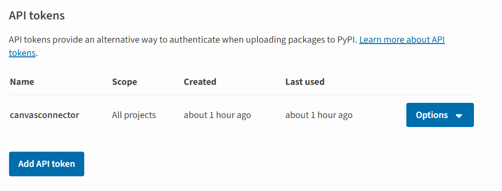
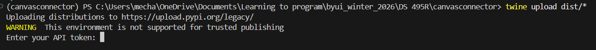
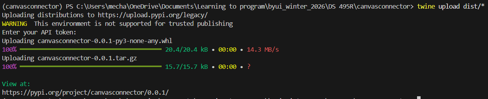
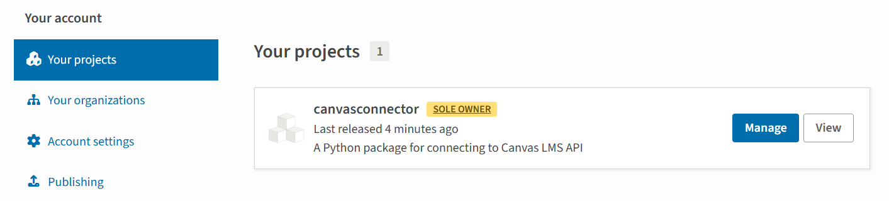
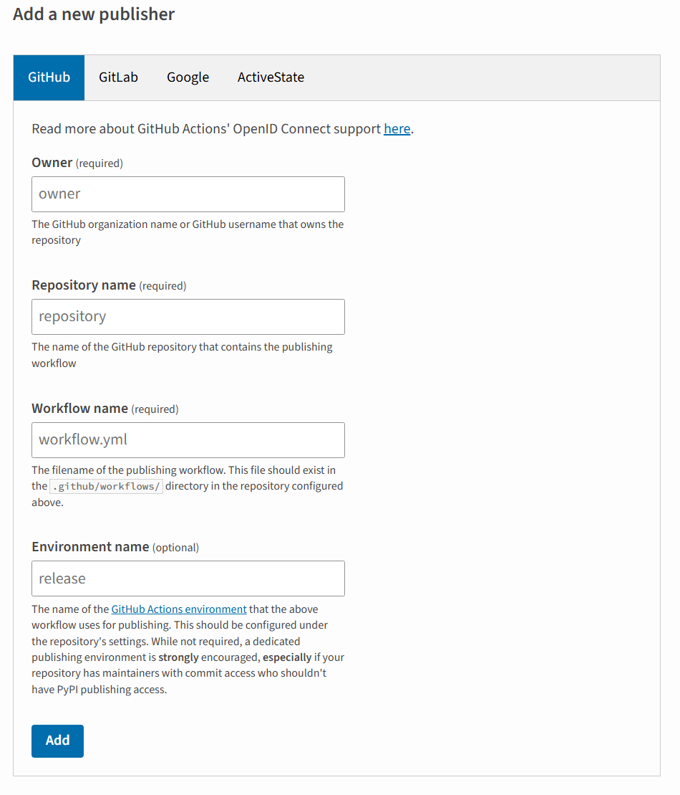
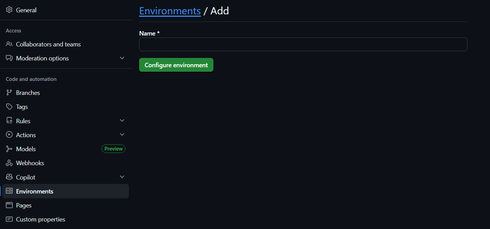
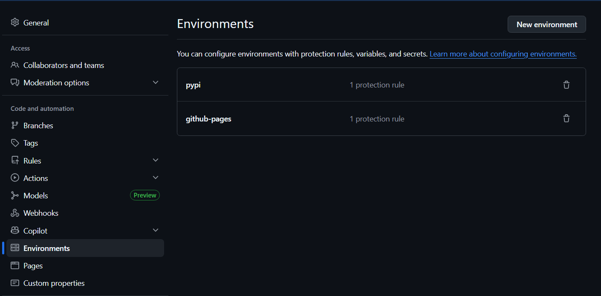
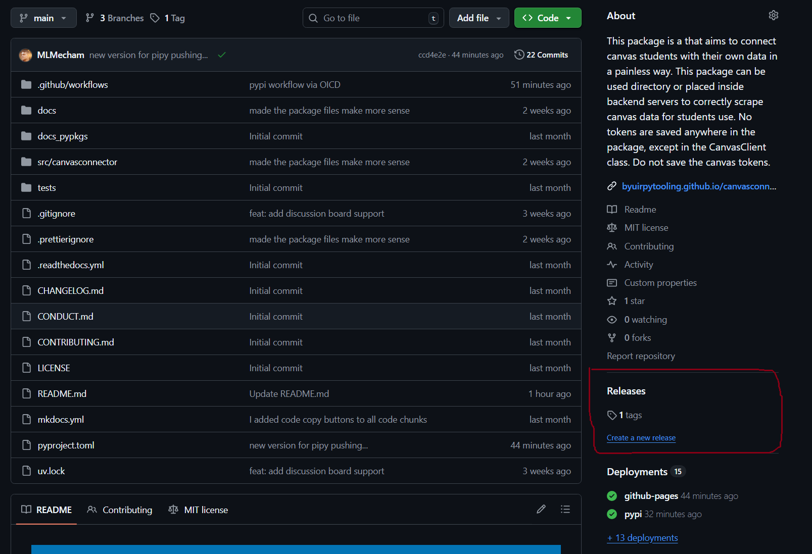
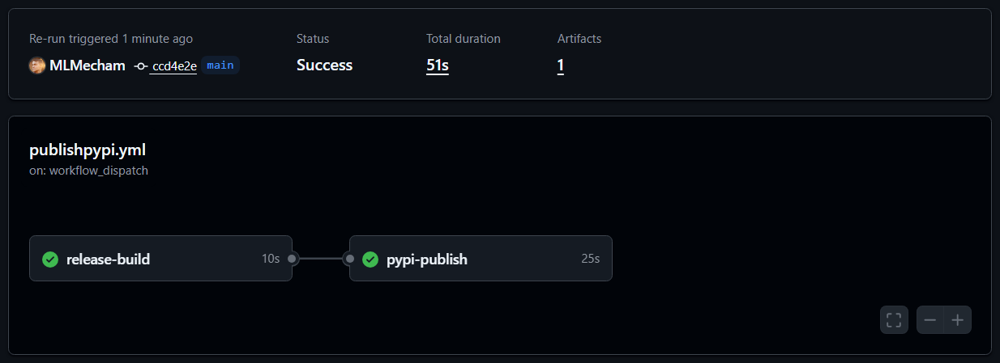
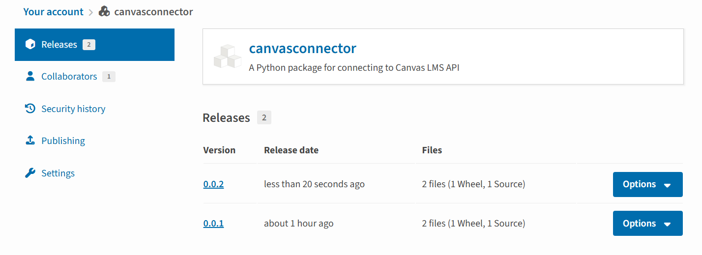

Once a package works well enough to share, the next step is getting it onto PyPI so anyone can install it with `pip install` or `uv add`. This post walks through how I published [canvasconnector](https://pypi.org/project/canvasconnector/) — a Python package for connecting to the Canvas LMS API — starting from a package that only lived on GitHub, all the way to automated releases through GitHub Actions using OIDC trusted publishing.

## What You Need Before Starting

Before touching PyPI, the package should be installable from GitHub and have a working `pyproject.toml`. The canvasconnector README already had installation instructions pointing at the GitHub repo:
```bash
uv pip install git+https://github.com/byuirpytooling/canvasconnector.git
```

That is fine for early development, but it is not discoverable and it requires users to know the exact GitHub URL. PyPI solves both of those problems.

You also need a PyPI account. Head to [pypi.org](https://pypi.org), sign up, and verify your email before continuing. If it gives you recovery codes, save them somewhere safe or risk losing access.

## The First Upload: Manual with Twine

PyPI requires the package to exist before you can configure automated publishing. So the first upload is manual. Start by building the package with uv:
```bash
uv build
```

This creates a `dist/` folder containing two files: a `.whl` wheel file and a `.tar.gz` source distribution. Then install twine as a global tool:
```bash
uv tool install twine
```

### Generating an API Token

Before uploading you need an API token. Since the package does not exist on PyPI yet, you cannot scope the token to a specific project. Go to your **account settings** (not a project page — the project does not exist yet) and find the **API tokens** section. Click **Add API token**, name it something like `canvasconnector`, set the scope to **All projects**, and copy the token immediately. You only see it once.



Now upload:
```bash
twine upload dist/*
```

Twine will prompt for a username and token. Enter `__token__` as the username (literally, that string) and paste your API token as the password.





Once it completes, the package is live. You can verify by going to your PyPI account page.




At this point `pip install canvasconnector` works for anyone in the world. The manual upload is done and the API token can be deleted since we are about to replace it with something better.

## Setting Up OIDC Trusted Publishing

OIDC (OpenID Connect) lets PyPI verify that a publish request is coming from a specific GitHub Actions workflow in a specific repository, without any stored credentials. No token to manage, rotate, or accidentally leak.

### Step 1: Add a Trusted Publisher on PyPI

Now that the package exists, go to your package on PyPI, click **Manage**, then **Publishing**. This is where you configure the GitHub connection — it lives under the project, not your account settings. Add a new trusted publisher under the GitHub tab and fill in:

- **Owner**: your GitHub organization or username (for canvasconnector this is `byuirpytooling`)
- **Repository**: `canvasconnector`
- **Workflow name**: `publishpypi.yml`
- **Environment name**: `pypi`



Make sure the owner matches the actual GitHub organization that owns the repo, not just your personal username. If they differ, the OIDC exchange will fail with an `invalid-publisher` error.

### Step 2: Create a GitHub Environment

GitHub Actions needs a named environment called `pypi` to match what PyPI expects. Go to your repository **Settings > Environments** and create a new environment named `pypi`.





The environment acts as a verified identity context. When the workflow runs inside it, GitHub issues a token that PyPI can validate against the trusted publisher configuration you just set up.

### Step 3: The GitHub Actions Workflow

Here is the full `publishpypi.yml` workflow:
```yaml
name: Upload Python Package

on:
  release:
    types: [published]

permissions:
  contents: read

jobs:
  release-build:
    runs-on: ubuntu-latest
    steps:
      - uses: actions/checkout@v4

      - uses: actions/setup-python@v5
        with:
          python-version: "3.x"

      - name: Build release distributions
        run: |
          pip install uv
          uv build

      - name: Upload distributions
        uses: actions/upload-artifact@v4
        with:
          name: release-dists
          path: dist/

  pypi-publish:
    runs-on: ubuntu-latest
    needs: release-build
    environment:
      name: pypi
    permissions:
      id-token: write
    steps:
      - name: Retrieve release distributions
        uses: actions/download-artifact@v4
        with:
          name: release-dists
          path: dist/

      - name: Publish release distributions to PyPI
        uses: pypa/gh-action-pypi-publish@release/v1
        with:
          packages-dir: dist/
```

The key parts are `id-token: write` in the permissions block, which enables OIDC, and `environment: name: pypi`, which scopes the workflow to the named environment. No password or secret is needed anywhere.

## Publishing a New Release

With everything wired up, releasing a new version is a deliberate three-step process:

1. Bump the version in `pyproject.toml` (for example, `0.0.1` to `0.0.2`)
2. Commit and push the change
3. Go to your GitHub repo and find the **Releases** section in the right sidebar, then click **Create a new release**



Create a tag matching the version (like `v0.0.2`), write release notes, and click **Publish release**. The workflow fires automatically from there.





The reason releases are manual rather than triggered on every push is intentional. A PyPI publish is permanent. You cannot overwrite or delete a version once it is live. Keeping the release step manual means you are making a conscious decision each time rather than accidentally shipping a half-finished commit.

## Verifying the Install

After publishing, the fastest way to confirm everything works is to create a fresh project and install from PyPI:
```bash
mkdir canvasconnector-test
cd canvasconnector-test
uv init
uv add canvasconnector
```

Then run a quick import to confirm it loads correctly. For canvasconnector, a successful connection looks like this:
```
https://byui.instructure.com
America/Denver
Connected successfully as: Mitchell Mecham
```

If that works, the package is live, installable, and functioning correctly for any user who finds it.

## Summary

The full process from GitHub-only to automated PyPI releases:

1. Build with `uv build` and upload manually with `twine upload dist/*` using an API token
2. Create a PyPI account and generate a temporary API token under **account settings** scoped to all projects
3. Once the package exists on PyPI, go to **Manage > Publishing** on the project page to configure OIDC trusted publishing
4. Create a `pypi` environment in GitHub repository settings
5. Add the `publishpypi.yml` workflow with `id-token: write` permissions and no stored credentials
6. For each future release: bump the version, push, and create a GitHub Release to trigger the workflow

The canvasconnector package is available at [pypi.org/project/canvasconnector](https://pypi.org/project/canvasconnector/) and the full source is at [github.com/byuirpytooling/canvasconnector](https://github.com/byuirpytooling/canvasconnector).